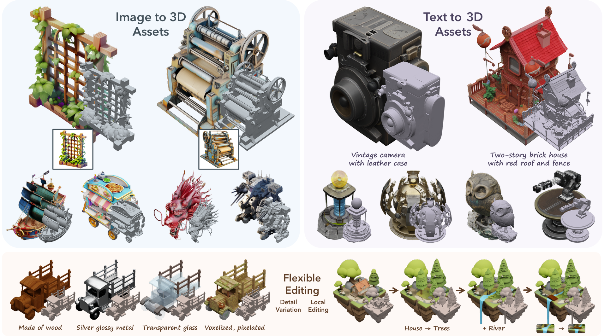

# DecompDreamer: A Composition-Aware Curriculum for Structured 3D Asset Generation

**Accepted to Transactions on Machine Learning Research (TMLR), 2026.**

Utkarsh Nath\*, Rajeev Goel\*, Rahul Khurana, Kyle Min, Mark Ollila, Pavan Turaga, Varun Jampani, Tejaswi Gowda

\*Equal contribution

[[Project Page]](https://decompdreamer3d.github.io/) [[OpenReview]](https://openreview.net/forum?id=3qy4J6QFbn) [[arXiv]](https://arxiv.org/abs/2503.11981)



## Abstract

Text-to-3D generation saw dramatic advances in recent years by leveraging Text-to-Image models. However, most existing techniques struggle with compositional prompts, which describe multiple objects and their spatial relationships. They often fail to capture fine-grained inter-object interactions. We introduce DecompDreamer, a Gaussian splatting-based training routine designed to generate high-quality 3D compositions from such complex prompts. DecompDreamer leverages Vision-Language Models (VLMs) to decompose a scene into objects and their relationships, then employs a curriculum strategy that first optimizes relationship-level (edge) representations to establish a coherent global structure, before refining individual objects. This staged approach mitigates gradient conflicts that arise when optimizing all objects and relationships simultaneously, resulting in disentangled, higher-fidelity 3D compositions. Extensive experiments demonstrate that DecompDreamer outperforms existing state-of-the-art methods in generating complex compositional 3D scenes.

## Method Overview

DecompDreamer generates a compositional 3D scene from a single text prompt via:

1. **Decomposition** — a VLM parses the prompt into per-object descriptions and pairwise ("edge") relationship descriptions (e.g. *"a knight galloping on a horse"* → objects `{knight, horse}` + edge `[knight, horse]`).
2. **Initialization** — each object is instantiated as a set of 3D Gaussians, seeded from a [Point-E](https://github.com/openai/point-e) point cloud (or a provided mesh/`.ply`), and placed according to inferred position, scale, and orientation.
3. **Two-stage curriculum optimization** (implemented in `train.py`):
   - **Stage 1 (relationships):** jointly optimizes each object pair under its edge prompt to establish global structure, with individual-object losses phased in progressively.
   - **Stage 2 (refinement):** optimizes each object individually against object-specific (and negative) prompts, while preserving the relationships learned in Stage 1.
4. **Flow Matching Distillation (FMD)** using Stable Diffusion 3.5 (`guidance/sd3_utils.py`) replaces standard SDS for smoother, less noisy gradients, with object-view-aware azimuth correction and negative prompting to prevent object bleed-through.

> **Note:** This repository is being cleaned up for public release. Per-scene config files
> (`configs/*.yaml`) and the latest code updates will be added soon.

## Repository Structure

```
train.py                  # main DecompDreamer training entry point
arguments/                # CLI / YAML argument definitions (Model, Optimization, Guidance, Camera)
guidance/sd3_utils.py      # Stable Diffusion 3.5 + Flow Matching guidance
gaussian_renderer/        # per-scene and per-object Gaussian rasterization
scene/                    # scene/camera management, Gaussian model
trellis/, LGM/, dataset_toolkits/   # vendored TRELLIS / LGM image-to-3D pipelines used for
                          # baseline comparisons and alternative object initialization
submodules/               # diff-gaussian-rasterization, simple-knn (CUDA rasterizer/KNN ops)
assets/                   # example images, point clouds, and the teaser above
```

`train.py` is the main DecompDreamer method described above.

## Installation

```bash
git clone --recursive https://github.com/rajeevgl01/DecompDreamer.git
cd DecompDreamer

conda create -n decompdreamer python=3.10 -y
conda activate decompdreamer

pip install -r requirements.txt

# CUDA rasterizer + KNN ops used by 3D Gaussian Splatting
pip install submodules/diff-gaussian-rasterization
pip install submodules/simple-knn
```

`requirements.txt` installs [Point-E](https://github.com/openai/point-e) directly from GitHub.
Guidance uses `stabilityai/stable-diffusion-3.5-medium` from Hugging Face, which is a gated
model — request access on the model page and run `huggingface-cli login` before training.

## Usage

Each compositional scene is described by a YAML config passed via `--opt` (prompt decomposition,
per-object/edge prompts, initialization, and optimization schedule):

```bash
python train.py --opt configs/<scene>.yaml
```

Example config files are not yet included in this release (see note above) — key fields to expect
in a config:

- `GuidanceParams.text` — the full compositional prompt.
- `GuidanceParams.prompt_obj` / `prompt_obj_neg` — per-object positive/negative prompts.
- `GuidanceParams.prompt_edge` / `edge_list` — per-relationship prompts and the object-index pairs they connect.
- `GenerateCamParams.init_list` / `init_prompt` — per-object initialization (`pointe` + a text prompt, or `ply` + a path to a mesh).
- `OptimizationParams.stage_2_iters` / `scene_iter_1` / `scene_iter_2` — controls the Stage 1 → Stage 2 curriculum split.

Outputs (checkpoints, rendered turntable videos, and per-object renders) are written to
`./output/<ModelParams.workspace>/`, and training curves are logged to Weights & Biases.

## Citation

```bibtex
@article{nath2026decompdreamer,
  title   = {DecompDreamer: A Composition-Aware Curriculum for Structured 3D Asset Generation},
  author  = {Nath, Utkarsh and Goel, Rajeev and Khurana, Rahul and Min, Kyle and Ollila, Mark and Turaga, Pavan and Jampani, Varun and Gowda, Tejaswi},
  journal = {Transactions on Machine Learning Research},
  year    = {2026},
  url     = {https://openreview.net/forum?id=3qy4J6QFbn}
}
```

## License

The 3D Gaussian Splatting components of this repository are adapted from Inria's original
implementation and are released for **non-commercial research and evaluation use only** —
see [`GAUSSIAN_SPLATTING_LICENSE.md`](GAUSSIAN_SPLATTING_LICENSE.md).

## Acknowledgements

This codebase builds on [3D Gaussian Splatting](https://github.com/graphdeco-inria/gaussian-splatting),
[Stable Diffusion 3.5](https://huggingface.co/stabilityai/stable-diffusion-3.5-medium),
[Point-E](https://github.com/openai/point-e), and [TRELLIS](https://github.com/microsoft/TRELLIS).
